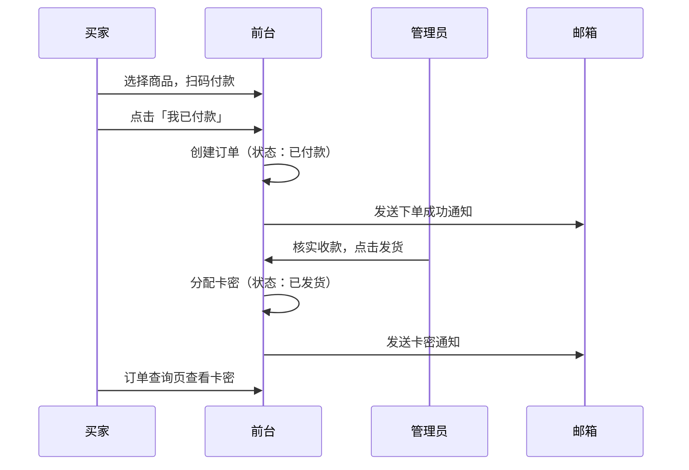

# 卡密商城 · 轻量级 PHP 发卡系统

一套开箱即用的虚拟卡密自动/半自动发货系统，适用于软件激活码、会员兑换码、游戏点卡等虚拟商品销售场景。前台提供商品浏览与下单，后台提供卡密库存、订单发货与站点配置等完整管理能力。

---

## 功能特性

### 前台（买家端）

- 商品列表展示，支持分类筛选与关键词搜索
- 商品详情页下单，支持微信 / 支付宝扫码付款（收款码模式）
- 邮箱验证码（配置 SMTP 后启用，防止恶意下单）
- 订单查询：按订单号或邮箱查询订单状态与卡密
- 公告弹窗、商品须知 / 充值流程跑马灯
- 微信 / QQ 客服联系方式与二维码展示
- 移动端自适应布局

### 后台（管理员）

- **仪表盘**：订单统计、近 7 日订单趋势图表
- **商品管理**：新增 / 编辑商品、批量导入卡密、查看库存与销量
- **分类管理**：商品分类增删与排序
- **订单管理**：确认发货、拒绝订单，发货后自动邮件通知买家
- **收款码管理**：上传微信 / 支付宝收款二维码
- **系统设置**：站点名称、LOGO、公告、FAQ、SMTP 邮件、客服信息等
- **修改密码**：管理员密码修改

### 技术特点

- 纯 PHP + MySQL，无框架依赖，部署简单
- 首次访问自动建表、写入默认配置
- 内置 SMTP 邮件发送（验证码、下单通知、发货通知）
- 卡密库存与订单发货事务保护，防止重复发卡

---

## 环境要求

| 项目 | 要求 |
|------|------|
| PHP | ≥ 7.4（推荐 8.x） |
| 扩展 | PDO、PDO_MySQL、Session、JSON |
| 数据库 | MySQL 5.7+ / MariaDB 10.3+ |
| Web 服务器 | Nginx / Apache（需支持 PHP） |
| 可选 | 已配置好 SMTP 的邮箱（用于验证码与发货通知） |

---

## 快速部署

### 1. 克隆项目

```bash
git clone https://github.com/你的用户名/发卡系统.git
cd 发卡系统
```

### 2. 创建数据库

在 MySQL 中创建空数据库，例如：

```sql
CREATE DATABASE card_shop DEFAULT CHARACTER SET utf8mb4 COLLATE utf8mb4_unicode_ci;
CREATE USER 'card_user'@'localhost' IDENTIFIED BY '你的强密码';
GRANT ALL PRIVILEGES ON card_shop.* TO 'card_user'@'localhost';
FLUSH PRIVILEGES;
```

### 3. 修改配置

编辑项目根目录 `config.php`，填写数据库连接信息：

```php
define('DB_HOST', 'localhost');
define('DB_PORT', '3306');
define('DB_NAME', 'card_shop');      // 数据库名
define('DB_USER', 'card_user');      // 数据库用户名
define('DB_PASS', '你的强密码');      // 数据库密码
```

> **安全提示**：请勿将包含真实密码的 `config.php` 提交到公开仓库。建议部署前修改所有默认凭据。

### 4. 设置目录权限

确保 Web 服务器对 `uploads/` 目录有写入权限（用于上传 LOGO、收款码、富文本图片等）：

```bash
chmod -R 755 uploads/
```

首次访问时系统会自动创建 `uploads/` 目录（若不存在）。

### 5. 配置 Web 服务器

将网站根目录指向项目文件夹，并确保 PHP 可正常解析。

**Nginx 示例：**

```nginx
server {
    listen 80;
    server_name your-domain.com;
    root /path/to/发卡系统;
    index index.php;

    location / {
        try_files $uri $uri/ /index.php?$query_string;
    }

    location ~ \.php$ {
        fastcgi_pass unix:/run/php/php8.2-fpm.sock;
        fastcgi_param SCRIPT_FILENAME $document_root$fastcgi_script_name;
        include fastcgi_params;
    }

    location ~ /\.ht {
        deny all;
    }
}
```

### 6. 首次访问

1. 浏览器打开 `http://你的域名/`，系统自动初始化数据库表结构
2. 访问 `http://你的域名/admin/` 进入后台
3. 使用默认密码 **`password`** 登录（见下方「安全说明」）
4. **登录后立即** 进入「修改密码」页面更换管理员密码

---

## 目录结构

```
发卡系统/
├── admin/              # 后台管理页面
│   ├── index.php       # 后台登录
│   ├── dashboard.php   # 仪表盘
│   ├── products.php    # 商品管理
│   ├── categories.php  # 分类管理
│   ├── orders.php      # 订单管理
│   ├── qrcodes.php     # 收款码管理
│   ├── settings.php    # 系统设置
│   └── password.php    # 修改密码
├── assets/
│   └── style.css       # 全局样式
├── uploads/            # 上传文件目录（LOGO、收款码等）
├── data/               # 数据目录（受 .htaccess 保护）
├── config.php          # 数据库与全局配置
├── api.php             # 前后台 API 接口
├── index.php           # 前台首页
├── product.php         # 商品详情 / 下单页
├── query.php           # 订单查询
└── content.php         # 商品须知 / 充值流程详情页
```

---

## 使用指南

### 管理员：从零搭建商城

建议按以下顺序完成初始配置：

```
创建分类 → 添加商品并导入卡密 → 上传收款码 → 配置 SMTP → 完善站点设置
```

#### 1. 分类管理

进入 **分类管理**，添加商品分类（如「软件激活码」「会员充值」等）。分类会显示在前台首页，方便买家筛选。

#### 2. 商品管理

进入 **商品管理** → **添加商品**，填写：

| 字段 | 说明 |
|------|------|
| 商品标题 | 前台展示名称 |
| 商品描述 | 简要说明 |
| 价格 | 单价（元） |
| 所属分类 | 可选 |
| 虚拟销量 | 前台「已售」= 虚拟销量 + 真实销量 |
| 状态 | 上架 / 下架 |
| 卡密内容 | 每行一条，创建时可批量导入 |

创建后也可在商品列表中点击「管理卡密」，继续批量追加库存。

#### 3. 收款码管理

进入 **收款码管理**，分别上传：

- 微信收款二维码
- 支付宝收款二维码

买家下单时会根据所选支付方式展示对应收款码。

> 本系统采用**收款码 + 人工确认**模式，未对接微信/支付宝官方支付接口。买家扫码付款后点击「我已付款」，管理员在后台核实到账后再发货。

#### 4. 系统设置

进入 **系统设置**，按需配置：

- **基础信息**：站点名称、LOGO、公告
- **SMTP 邮件**：发件服务器、端口、账号、密码（配置后启用邮箱验证码，并发送下单/发货通知）
- **跑马灯**：商品须知、充值流程的文字与颜色
- **富文本内容**：商品须知详情、充值流程详情（支持插入图片）
- **FAQ / 卡密使用方法 / 退款政策**：显示在商品详情页
- **客服信息**：微信 / QQ 账号及二维码

#### 5. 订单处理

进入 **订单管理**，订单状态说明：

| 状态 | 含义 | 操作 |
|------|------|------|
| 已付款 | 买家已提交订单，等待核实 | 核实到账后点击「发货」；未到账可「拒绝」 |
| 已发货 | 卡密已分配并通知买家 | 无需操作 |
| 已拒绝 | 订单被拒绝 | 无需操作 |

点击 **发货** 后，系统会：

1. 从库存中按购买数量自动分配未使用的卡密
2. 更新订单状态为「已发货」
3. 向买家邮箱发送卡密内容（需已配置 SMTP）
4. 买家也可在「订单查询」页面查看卡密

---

### 买家：购买流程

```
浏览商品 → 填写邮箱 → （验证码）→ 选择数量与支付方式 → 扫码付款 → 确认已付款 → 等待发货 → 查询卡密
```

1. 在首页浏览或搜索商品，点击进入商品详情
2. 填写接收卡密的邮箱；若管理员已配置 SMTP，需先获取并填写邮箱验证码
3. 选择购买数量与支付方式（微信 / 支付宝）
4. 点击「提交订单」，扫描弹窗中的收款码完成付款
5. 付款后点击 **「我已付款」**，系统创建订单并跳转至订单查询页
6. 等待管理员核实并发货
7. 发货后，卡密会发送至邮箱，也可在 [订单查询](query.php) 页面查看

---

## 订单与支付说明

本系统的支付流程为 **半自动模式**：



- 买家点击「我已付款」后订单即进入 **已付款** 状态，**不会自动发卡**
- 管理员需在后台核实实际到账后再手动发货
- 若未收到款项，可将订单 **拒绝**

---

## 安全说明

1. **修改默认密码**：首次部署后默认管理员密码为 `password`，请立即在后台「修改密码」中更换
2. **保护 config.php**：其中包含数据库凭据，勿提交真实密码到公开仓库
3. **uploads 目录**：仅用于存放图片，已通过 `.htaccess` 限制脚本执行
4. **data 目录**：已通过 `.htaccess` 禁止 Web 直接访问
5. **HTTPS**：生产环境建议启用 HTTPS，保护下单与后台登录安全
6. **SMTP 凭据**：邮件账号密码保存在数据库 `settings` 表中，请妥善保管服务器与数据库访问权限

---

## 常见问题

**Q：访问首页提示「数据库连接失败」？**  
A：检查 `config.php` 中的数据库主机、库名、用户名、密码是否正确，并确认 MySQL 服务已启动。

**Q：买家收不到验证码或发货邮件？**  
A：在后台「系统设置」中检查 SMTP 配置是否正确，确认发件邮箱已开启 SMTP 服务（如 QQ 邮箱需使用授权码）。

**Q：下单时没有验证码输入框？**  
A：未配置 SMTP 时系统会跳过邮箱验证，直接展示收款码。配置 SMTP 后会自动启用验证码。

**Q：点击发货提示库存不足？**  
A：在「商品管理」中为该商品补充卡密，确保未使用卡密数量 ≥ 订单购买数量。

**Q：能否对接微信/支付宝官方支付？**  
A：当前版本为收款码 + 人工确认模式。如需全自动支付回调与自动发货，需自行二次开发或接入支付 SDK。

**Q：如何备份数据？**  
A：定期备份 MySQL 数据库（含商品、卡密、订单、设置等全部数据）以及 `uploads/` 目录中的上传文件。

---

## 技术栈

- **后端**：PHP（PDO + Session）
- **数据库**：MySQL / MariaDB
- **前端**：原生 HTML / CSS / JavaScript
- **图表**：Chart.js（后台仪表盘）
- **图标**：Font Awesome 6

---

## 开源协议

本项目采用 MIT 协议开源，可自由使用、修改与分发。使用时请保留原作者版权声明。

---

## 贡献与反馈

欢迎提交 Issue 或 Pull Request。如有问题或建议，请在 GitHub 仓库中反馈。
